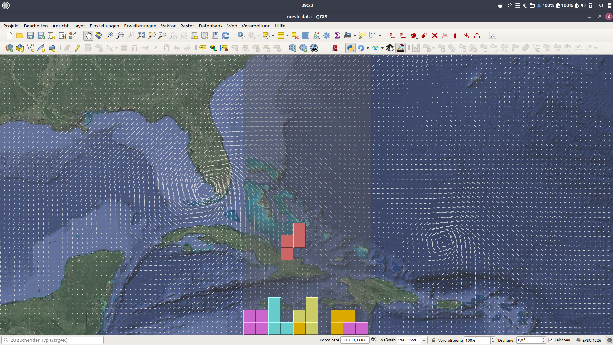

# Tetris
==========

Play Tetris on the map canvas.

The actual game code was taken from here http://zetcode.com/gui/pyqt5/tetris/

Controls
-----------
WASD    move and rotate
SPACE   drop a piece
P       pause

